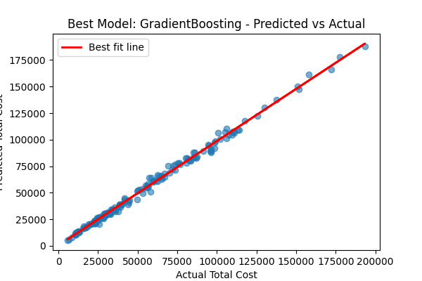

# 📘 International Education Budget Planner

This project provides a predictive pipeline to estimate the **Total Cost of Attendance (TCA)** for international students based on reduced but essential factors such as program, university, and living costs. It includes exploratory data analysis (EDA), a streamlined machine learning pipeline, feature importance analysis, and an interactive Streamlit web application.

---

## 🔍 Objective
Build a lightweight and interpretable machine learning model to estimate the financial burden of studying abroad using reduced real-world cost indicators.

---

## 🧪 Exploratory Data Analysis (EDA)
- Checked for missing values and data quality issues
- Explored distributions of tuition, rent, and other numeric costs
- Analyzed category balance in `University`, `Program`, and `Level`
- Used boxplots and histograms to visualize cost variations
- Investigated cost clustering using domain-specific heuristics

EDA insights guided feature reduction and selection.

### 📊 Example Visuals:
- 
- 

---

## 🧠 Machine Learning Pipeline
- Models: `RandomForestRegressor`, `GradientBoostingRegressor`, `XGBoost`
- Data preprocessing with `OneHotEncoder` and `StandardScaler`
- Pipeline and model tracking using `MLflow`
- Feature importance visualization

**Target variable:** `Total_cost`

### Feature Engineering
- **Categorical**: University, Program, Level
- **Numerical**: Living Index, Rent, Insurance, Visa Fees, Duration

---

## 📦 Feature Selection Philosophy

This version retains **a minimal subset of features** based on data-driven reduction while preserving domain-critical fields.

### Why?
- Reduces noise and complexity
- Improves generalizability
- Still captures the core cost drivers based on EDA and prior importance plots

### 📈 Grouped Importance Visual
- 

**Conclusion:** Simpler feature sets were tested to achieve better bias-variance trade-off without losing critical context.

---

## 📈 Outputs
- Model evaluation metrics: MAE, RMSE, R²
- Grouped feature importance graph
- Prediction vs Actual plot
- Classification report of affordability tiers (Low, Medium, High)
- MLflow run logs and model artifacts

### Example Evaluation Visuals
- 
- 

---

## 💻 Streamlit Web App
### Key Features:
- Predicts TCA based on user inputs
- Interactive affordability world map
- Cluster segment explorer by cost tiers

Launches with:
```bash
streamlit run webapp.py
```

---

## 🧪 How to Run the Model Pipeline
```bash
python mlflow_run.py
```
This trains models, logs results to MLflow, and exports:
- `model_pipeline.pkl` — best model pipeline
- `grouped_feature_importance.png` — feature analysis
- `model_predictions.csv` — final evaluation predictions

---

## 📁 Files
| File | Description |
|------|-------------|
| `mlflow_run.py` | Training pipeline script with MLflow integration |
| `webapp.py` | Streamlit dashboard for prediction and visualization |
| `data_tca_clusters_raw.csv` | Raw input dataset |
| `model_pipeline.pkl` | Serialized model pipeline (auto-generated) |
| `grouped_feature_importance.png` | Feature importance plot (auto-generated) |
| `best_model_plot_*.png` | Model performance plots |
| `r2_vs_topn_plot.png` | Feature reduction vs R² performance |

---

## ✅ Requirements
- `scikit-learn`
- `xgboost`
- `mlflow`
- `pandas`, `numpy`, `matplotlib`
- `streamlit`, `plotly`

Install with:
```bash
pip install -r requirements.txt
```

---

## 🙋‍♀️ Author
- Cholpon Zhakshylykova  
*collaborative project SDS CP030*
