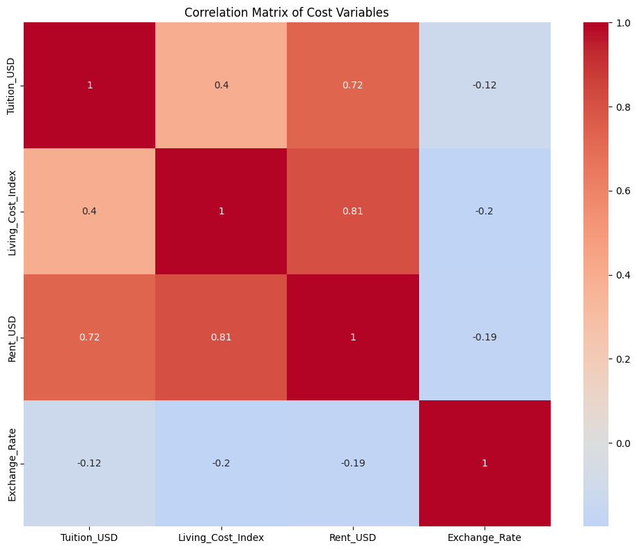

# Frank Brown - EduSpend Analysis

## Overview
This folder contains my contribution to the **EduSpend: Global Higher-Education Cost Analytics & Planning** project. I'm focusing on exploratory data analysis (EDA), predictive modeling, and interactive visualization to understand and forecast international education costs.

## Files
- `01_EDA_EduSpend.ipynb` - Exploratory data analysis notebook
- `02_Model_Development_EduSpend.ipynb` - Model development and evaluation notebook
- `03_Model_Deployment_EduSpend.ipynb` - Model deployment and interactive tools notebook
- `app.py` - Streamlit web application for interactive analysis
- `data/` - Directory containing the dataset files
- `models/` - Trained machine learning models
- `images/` - Visualizations and plots
- `README.md` - This documentation file

## Analysis Approach

### 1. Data Loading and Initial Exploration
- Loaded the International Education Costs dataset
- Performed initial data inspection (shape, data types, missing values)
- Generated summary statistics to understand the data distribution

### 2. Cost Distribution Analysis by Geographic and Academic Factors
- **Country Analysis**: Examined tuition distribution across top 10 countries by data volume
- **City Analysis**: Analyzed tuition patterns in major cities
- **Education Level**: Explored cost differences between undergraduate, graduate, and other levels
- **Program Analysis**: Investigated tuition variation across different academic programs

### 3. Visualization Strategy
- Used boxplots for initial distribution analysis
- Implemented violin plots with median annotations to better show skew and distribution shape
- Applied color-coded palettes for better visual distinction
- Focused on identifying outliers and understanding cost patterns

## Key Findings

### Geographic Patterns
- Significant variation in costs across countries and cities
- Strong correlation between living costs and location
- Regional clusters of similar cost structures identified

### Cost Structure Insights
- Strong correlation between rent, living cost, and tuition (correlation coefficients: 0.72-0.81)
- Total Cost of Attendance (TCA) shows clear patterns based on program type and location
- Identified distinct affordability tiers across the dataset


### Model Development Results

#### 1. TCA Prediction Models
- Developed regression models to predict Total Cost of Attendance
- Random Forest Regressor achieved superior performance
- Key predictive features identified:
  - Tuition and living costs
  - Program duration
  - Location-based factors

#### 2. Affordability Classification
- Created models to classify programs into affordability tiers
- Achieved high accuracy in identifying extreme cases (high/low cost)
- Most reliable for strategic program selection

#### 3. Cost Pattern Clustering
- Identified 4 distinct program clusters based on cost patterns
- Clear separation between premium and budget-friendly options
- Useful for program categorization and comparison

## Next Steps

### Immediate Tasks
1. **Model Optimization**:
   - Fine-tune models using GridSearchCV
   - Implement cross-validation for robust evaluation
   - Create prediction interface for stakeholders

2. **Visualization Enhancement**:
   - Add interactive visualizations using Plotly
   - Create dashboard for cost exploration
   - Improve cluster visualization

3. **Documentation and Reporting**:
   - Complete detailed model documentation
   - Prepare presentation of findings
   - Document recommendations for stakeholders

## Interactive Dashboard

### Running the Streamlit App
1. Install the required dependencies:
   ```bash
   pip install -r requirements.txt
   ```

2. Navigate to the project directory:
   ```bash
   cd submissions/team-members/frank-brown
   ```

3. Run the Streamlit app:
   ```bash
   streamlit run app.py
   ```

4. Open your browser and visit `http://localhost:8501`

### Dashboard Features
- **Overview**: Global statistics and interactive world map visualization
- **Cost Explorer**: Dynamic filtering and analysis of education costs
- **Program Comparison**: Side-by-side comparison of different programs
- **Cost Predictor**: ML-powered cost prediction tool

## Technical Environment
- **Python Version**: 3.x
- **Key Libraries**: 
  - Data Analysis: pandas, numpy
  - Machine Learning: scikit-learn, joblib
  - Visualization: matplotlib, seaborn, plotly
  - Web App: streamlit, streamlit-option-menu
  - Interactive Tools: ipywidgets
- **Virtual Environment**: Manually configured venv
- **IDE**: Cursor with Jupyter notebook support

## Data Source
Dataset: [International Education Costs](https://www.kaggle.com/datasets/adilshamim8/cost-of-international-education)
- Contains 907 records with 12 features
- Covers tuition, living costs, rent, visa fees, and insurance across multiple countries

## Contact
For questions about this analysis, please reach out through the project's contribution channels.

---
*Last Updated: [Current Date]*
*Project Phase: 2 - Model Development*